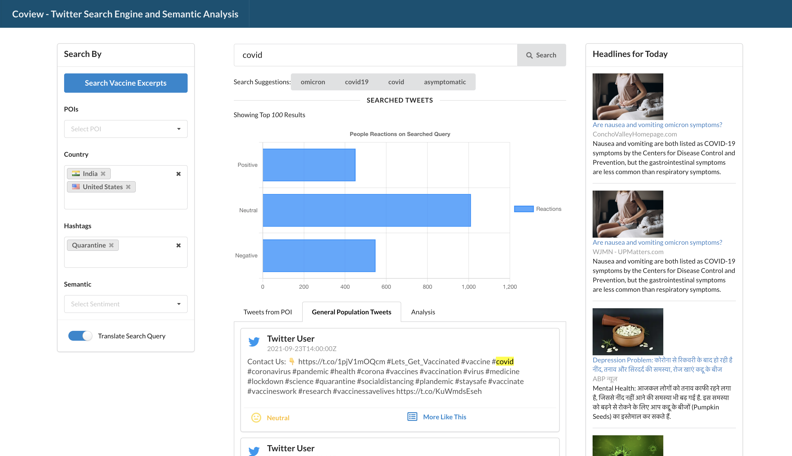

# coview
CoView is a Twitter Search Engine with Sentiment Analyzer for Covid Tweets and Analytics Engine.

Features:
- User can search their query over the corpus of around 250k tweets and over three different languages – English, Hindi, Spanish.
- Overall sentiment of the general population can be seen towards the user’s query.
- The user can also use the gnews.io API to get more information regarding their query from trusted resources.
- Filters by location/country, language, hashtags, sentiment.
- A translate query toggle for allowing the user to search the same query in different languages.
- Implemented Fuzzy searching in case the user inputs a misspelled query.
- Various Analytics on the tweets like tweet distribution by language, country, top hashtags, also a live time graph showing the number of tweets about the query of the user made by different POIs from the start of 2020.

Technologies Used:
- Python 3.9 and Flask App
- React.js for UI
- ElasticSearch 
- Twitter API
- GNews API
- NLTK
- Google and Microsoft Azure Translate API
- D3.js for Analysis Graphs

